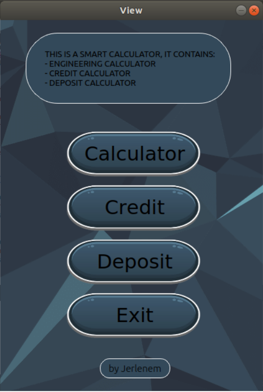
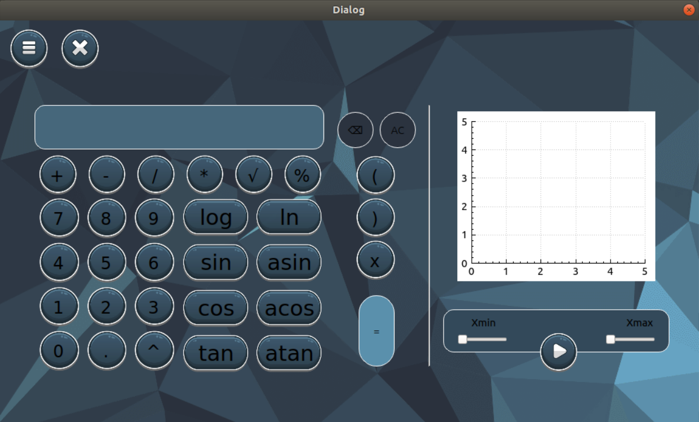
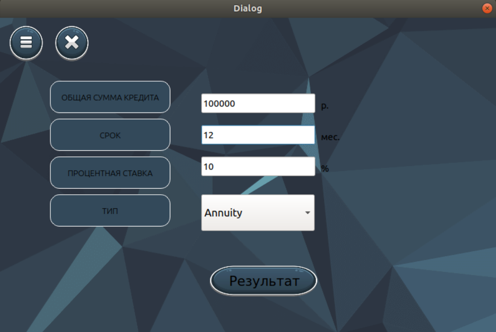
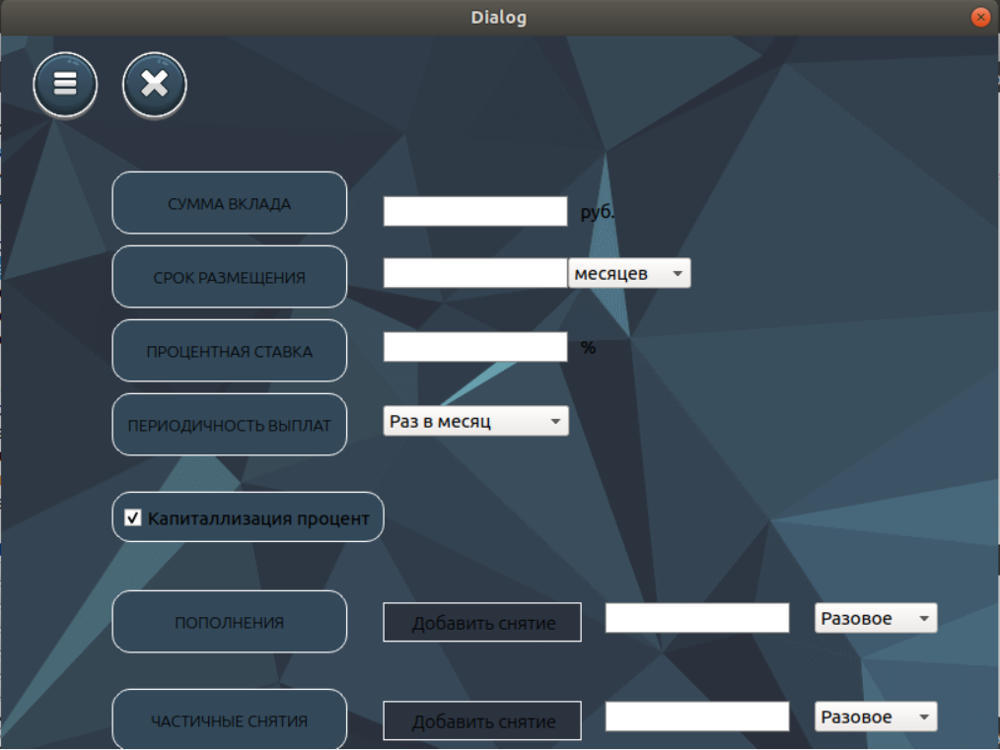

# SmartCalc v2.0

Реализация SmartCalc v2.0.

## Introduction

В данном проекте Вам предстоит реализовать на языке программирования С++ в парадигме объектно-ориентированного программирования расширенную версию обычного калькулятора, реализующую те же самые функции, что и разработанное ранее приложение в проекте SmartCalc v1.0. Помимо базовых арифметических операций, как плюс-минус и умножить-поделить, Вам необходимо дополнить калькулятор возможностью вычисления арифметических выражений с учетом приоритетов, а так же некоторыми математическими функциями (синус, косинус, логарифм и т.д.). Помимо вычисления выражений калькулятор так же должен поддерживать использование переменной x и построение графика соответствующей функции. В качестве дополнительных улучшений можно будет рассмотреть кредитный и депозитный калькулятор.

## 1. Реализация SmartCalc v2.0

Необходимо реализовать SmartCalc v2.0:

- Программа должна быть разработана на языке C++ стандарта C++17
- Код программы должен находиться в папке src
- При написании кода необходимо придерживаться Google Style

        | Название оператора | Инфиксная нотация   (Классическая) | Префиксная нотация   (Польская нотация) |  Постфиксная нотация   (Обратная польская нотация) |
        | ------ | ------ | ------ | ------ |
        | Скобки | (a + b) | (+ a b) | a b + |
        | Сложение | a + b | + a b | a b + |
        | Вычитание | a - b | - a b | a b - |
        | Умножение | a * b | * a b | a b * |
        | Деление | a / b | / a b | a b \ |
        | Возведение в степень | a ^ b | ^ a b | a b ^ |
        | Остаток от деления | a mod b | mod a b | a b mod |
        | Унарный плюс | +a | +a | a+ |
        | Унарный минус | -a | -a | a- |

    - **Функции**:
  
        | Описание функции | Функция |   
        | ---------------- | ------- |  
        | Вычисляет косинус | cos(x) |   
        | Вычисляет синус | sin(x) |  
        | Вычисляет тангенс | tan(x) |  
        | Вычисляет арккосинус | acos(x) | 
        | Вычисляет арксинус | asin(x) | 
        | Вычисляет арктангенс | atan(x) |
        | Вычисляет квадратный корень | sqrt(x) |
        | Вычисляет натуральный логарифм | ln(x) | 
        | Вычисляет десятичный логарифм | log(x) |

## 2. Кредитный калькулятор

Расчет выплат, общей суммы и переплата расчитывается по входным данным. 
 - Вход: общая сумма кредита, срок, процентная ставка, тип (аннуитетный, дифференцированный)
 - Выход: ежемесячный платеж, переплата по кредиту, общая выплата

## 3. Депозитный калькулятор

Расчет сумма на вкладе к концу срок, % и сумма  налога по входным данным. 
 - Вход: сумма вклада, срок размещения, процентная ставка, налоговая ставка, периодичность выплат, капитализация процентов, список пополнений, список частичных снятий
 - Выход: начисленные проценты, сумма налога, сумма на вкладе к концу срока
